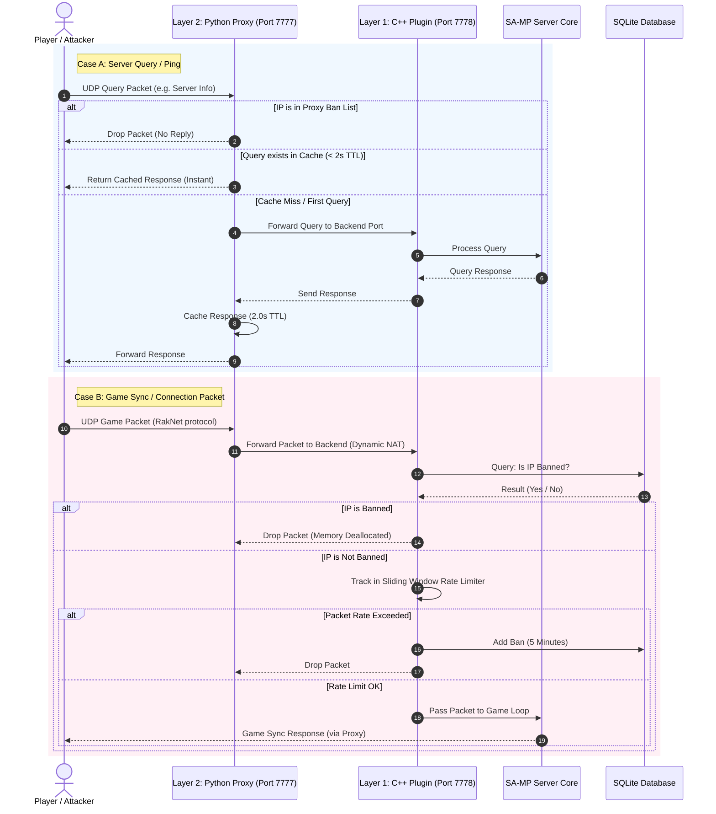

# ShieldWall DDoS Protection Suite

ShieldWall is a multi-layer anti-DDoS protection suite designed for SA-MP (San Andreas Multiplayer) and open.mp servers. It consists of three integrated layers: an asynchronous Python query proxy, a C++ RakNet packet filter plugin, and a Pawn administration filterscript.

---

## System Architecture

The protection suite operates on three distinct layers to intercept, filter, and cache network traffic before it can exhaust server resources.



### Component Breakdown

| Layer | Component | Primary Responsibility | Technical Mechanism |
|---|---|---|---|
| **Layer 1** | C++ RakNet Filter Plugin | In-memory packet filtering and rate limiting | Virtual Method Table (VMT) Detouring & SQLite |
| **Layer 2** | Python Query Proxy | Query caching and public network masking | Asynchronous UDP socket multiplexing (NAT) |
| **Layer 3** | Pawn Administration Script | Admin command interface and dynamic ban management | Plugin natives & SQLite CRUD |

#### Layer 1: C++ RakNet Packet Filter Plugin
* **Virtual Method Table Hooking**: Detours the `Receive` virtual method (vtable index 9 on Windows, 10 on Linux) of `RakServerInterface` to filter packets before the server core can parse them.
* **Sliding Window Rate Limiter**: Tracks incoming packet timestamps per IP address within a rolling 1.0-second window to detect and block flooders.
* **Persistent SQLite Bans**: Queries the local `shieldwall.db` instantly to drop packets from blacklisted IPs.
* **Legacy RakNet Integration**: Implements a custom `PlayerID::ToString` converter to extract and format IP strings from binary network addresses.

#### Layer 2: Python Query Proxy
* **Query Interception**: Distinguishes SA-MP query packets (prefixed with `SAMP` magic header) from raw game sync packets.
* **Response Caching**: Caches server information, rules, and player list responses with a 2.0-second Time-To-Live (TTL) to block reflection/amplification attacks.
* **Automated IP Banning**: Automatically detects query floods exceeding the rate limit (default: 50 queries/sec) and applies a 60-second block.
* **Transparent Game Routing**: Routes active connection packets dynamically to the backend server using an asynchronous NAT-style socket pool.

#### Layer 3: Pawn Administration Filterscript
* **Real-time Commands**: Exposes administrative actions (`/shield ban`, `/shield unban`, `/shield limit`, `/shield check`) to server operators.
* **Plugin Native Interfacing**: Links in-game scripts directly to C++ plugin logic via native function mappings defined in `shieldwall.inc`.

---

## Installation and Setup

### Prerequisites
- Python 3.8 or higher
- C++ Compiler / Build Tools (MSVC for Windows, GCC for Linux)
- SA-MP or open.mp server files

### Step 1: Install the C++ Plugin
1. Place the compiled `shieldwall.dll` (Windows) or `shieldwall.so` (Linux) inside the `plugins/` directory of your SA-MP server.
2. Add the plugin to your `server.cfg` file:
   ```text
   plugins shieldwall
   ```

### Step 2: Set Up the Pawn Include and Filterscript
1. Copy `shieldwall.inc` to your server's `pawno/include/` directory.
2. Compile `shieldwall.pwn` into `shieldwall.amx` and place it in the `filterscripts/` directory.
3. Add the filterscript to your `server.cfg` file:
   ```text
   filterscripts shieldwall
   ```

### Step 3: Configure and Launch the Python Query Proxy
1. Configure your SA-MP server to bind to a backend port (e.g. 7778) in `server.cfg`:
   ```text
   port 7778
   ```
2. Configure the query proxy in `proxy/config.json`:
   ```json
   {
     "proxy_ip": "0.0.0.0",
     "proxy_port": 7777,
     "backend_ip": "127.0.0.1",
     "backend_port": 7778,
     "query_rate_limit": 50,
     "query_ban_duration": 60,
     "cache_ttl": 2.0
   }
   ```
3. Place `start.bat` in the root folder of your SA-MP server and double-click it. This will launch both the Python Query Proxy and the SA-MP server simultaneously.

---

## Administration Commands

The following commands are available to administrators in-game:

| Command | Arguments | Description |
|---|---|---|
| /shield status | None | Displays the current protection status of Layer 1 and Layer 2. |
| /shield ban | [IP] [duration_sec] [reason] | Bans an IP address dynamically for a specified duration. |
| /shield unban | [IP] | Unbans a previously banned IP address. |
| /shield check | [IP] | Checks whether an IP address is currently banned. |
| /shield limit | [packets_per_sec] | Adjusts the packet rate limit threshold dynamically. |

---

## Authors
- fa33az
